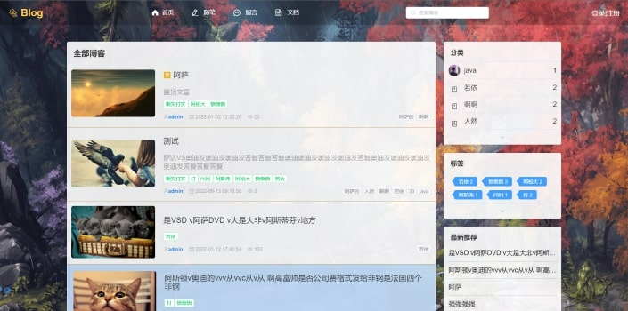
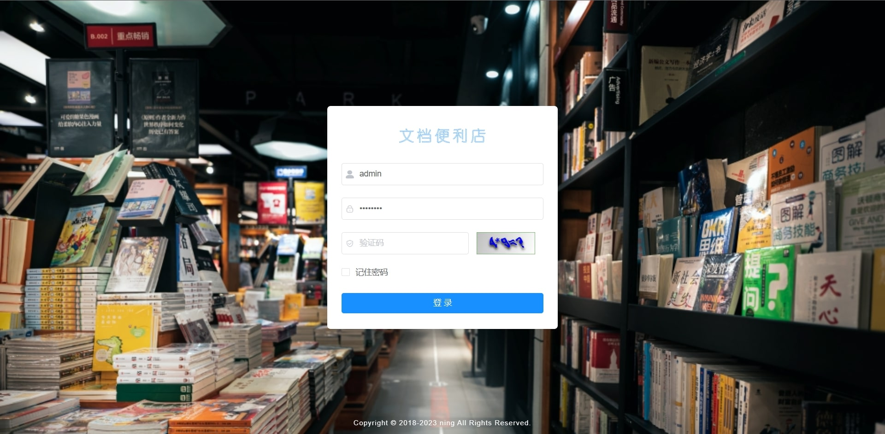
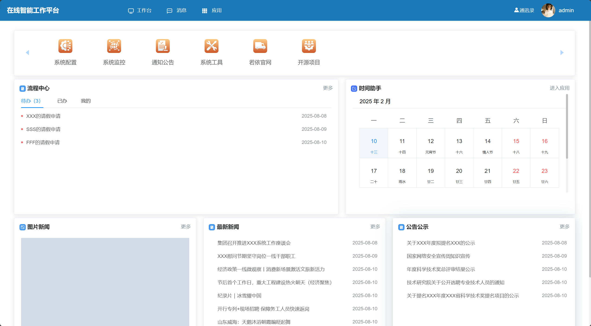
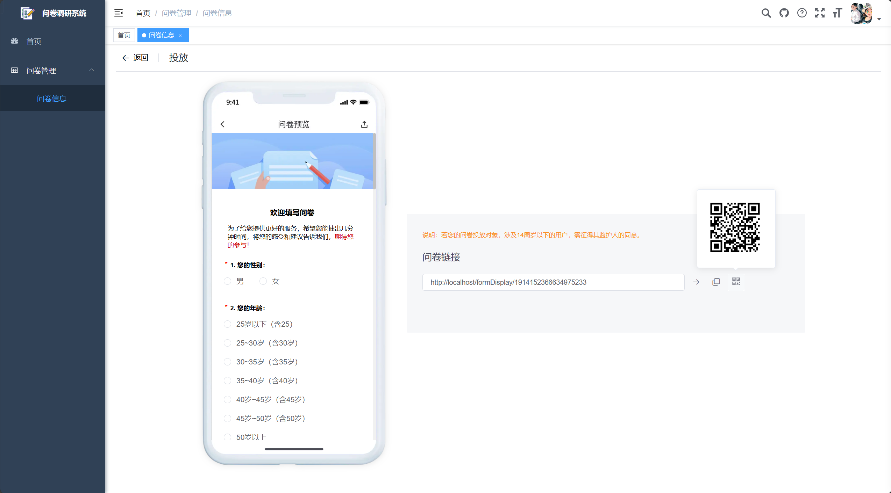

<!-- _coverpage.md -->

    
    
    

<!-- 

 -->

# 一些无聊的开源项目 <small>⑤</small>

[关注作者](https://310975876.github.io)

<!-- - 开源Blog博客网站
- 文档便利店
- “欣然有你”
- ... -->

  

    

      

		

          
		  Blog博客网站
        

        

		  
采用 Spring Boot + MyBatis，前端 vue + element-ui

          
支持多种编辑器：CherryMarkdown • Quill • Tinymce

          
支持标签分类检索，支持移动端和小程序

        

        

		  <a href="#/RuoYi-Vue-Blog/" style="text-decoration: none;color: inherit;display: block;width: 100%;height: 100%;">查看文档</a>
        

      

      

		

          

          

          

        

        

          
        

      

    

  

  

    

      

		

          

          

          

        

        

          
        

      

      

		

          
		  文档便利店
        

        

		  
完全免费的在线文档

          
全能白板 • 思维导图 • BPMN • 电子表格 • 幻灯片 • Markdown • 代码 • ChatGPT

          
敬请期待：文档 • 流程图 • 简历 • 设计 • 图片编辑 • 甘特图 • 图表

        

        

		  <a href="#/RuoYi-Vue-DocHub/" style="text-decoration: none;color: inherit;display: block;width: 100%;height: 100%;">查看文档</a>
        

      

    

  

  
  

    

      

  		

          
  		  在线智能工作平台
        

        

          
基于RuoYi平台开发

  		  
采用 Spring Boot + MyBatis，前端 vue + element-ui

          
支持多应用管理，工作流，协作日历，新闻管理，IM即时通讯等。

        

        

  		  <a href="#/RuoYi-Vue-Intelligent-Platform/" style="text-decoration: none;color: inherit;display: block;width: 100%;height: 100%;">查看文档</a>
        

      

      

  		

          

          

          

        

        

          
        

      

    

  

  

    

      

		

          

          

          

        

        

          
        

      

      

		

          
		  问卷调研系统
        

        

		  
轻量、安全的调研问卷系统

          
多类型数据采集，轻松创建调研表单：文本输入、数据选择、评分、日期、时间等。

          
智能逻辑编排，精细权限管理，数据在线分析和导出，主题自由定制

        

        

		  <a href="#/RuoYi-Vue-Research-System/" style="text-decoration: none;color: inherit;display: block;width: 100%;height: 100%;">查看文档</a>
        

      

    

  

  

    

      

		

        

		

        

      

      

		

          
		  Blog移动端
        

        

		  
Blog博客分享移动端

          
基于uniapp，前端组件采用uni-ui

          
支持标签分类检索

        

        

		  <a href="#/RuoYi-Vue-Blog-Uniapp/" style="text-decoration: none;color: inherit;display: block;width: 100%;height: 100%;">查看文档</a>
        

      

    

  

  

    

      

		

          
		  欣然有你
        

        

		  
基于uniapp，前端组件采用uni-ui，全端兼容的高性能UI框架

          
Blog文章分享 • 个人信息展示

          
支持小程序、H5、Android和IOS

        

        

		  <a href="#/photoGraphy-Uniapp/" style="text-decoration: none;color: inherit;display: block;width: 100%;height: 100%;">查看文档</a>
        

      

      

		

        

		

        

		

        

      

    

  

<!-- [Gitee](https://gitee.com/Ning310975876)
[start](README) -->

<!-- 背景图片 -->

<!--  -->

<!-- 背景色 -->

<!--  -->